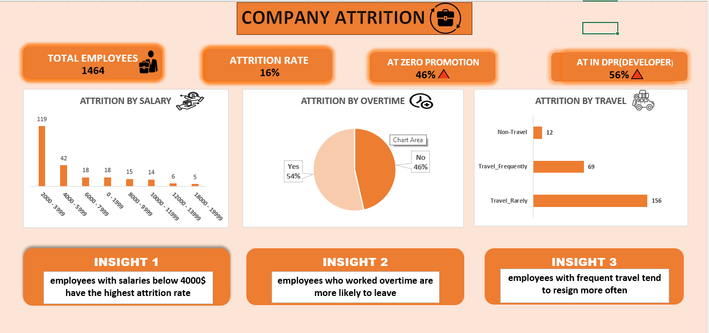
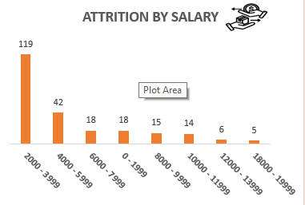
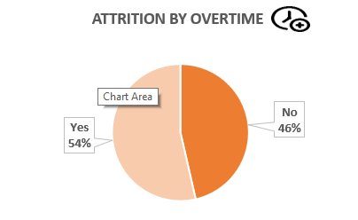

# company_attrition_data_analysis_
data analysis project using excel to explore company attrition 
## Data source :
from kaggel 
## Tools used :
Excel using Power_Query
## Project Question : 
What factors influence employee attrition in the company ??
## Explore data :
the data contains 1471 rows and 33 columns 
## Clean data :
1- unimportant columns were removed from the analysis 

2- removed errors 

3- removed duplicate data 

4- each column was converted to a number , data or text format depending on the column and its contents

5- prepared the dataset for analysis 
## data analysis : 

                                                          Dashboard

employees with salaries below 5000 show the highest resignation rate 

employees who work overtime account for more than half of the resignations

employees who travel account for more than 90% of the resignations
## key insights :
1- low salaries may be a major reason for employees resignations due to the high percentage associated with them , or could it be a coincidence??

2- overtime may be one of the main reasone for resignation , as 54% of those who resigned worked overtime 

3- business travel could be a major factor in resignations ,accounting for about 90% of them

4- 46% of employees who resigned had zero promotion , could this be a coincidence ??

5-resignations in the developer department account for 56% which may indicate issues in this department 
